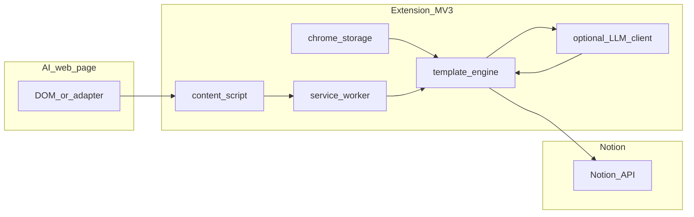

# MV3 与可定制同步方案（架构计划）

**Language**: 本文件正文以中文为主；**MV3 规则、占位符表、Notion 配置步骤**的英文入口见根目录 [`README.md`](../README.md)。

---

## 产品故事（要解决什么）

- **问题**：在 ChatGPT / Claude / Gemini 等网页里的对话，用户希望**按自己的结构**落到 Notion（标题、摘要/描述、正文），而不是固定剪贴板格式。
- **结果**：用扩展在本地解析页面 → 用**可配置模板**生成标题/描述/正文 → 通过 **Notion API** 创建页面；可选地先把文本发到用户自配的 **OpenAI 兼容 LLM** 再写入。
- **隐私立场**：默认只把解析结果发往 **Notion**（用户配置的 integration）。**LLM 重组默认关闭**；开启后必须在 UI 上明确提示「内容将发往你配置的 HTTP 源」。

---

## 文档分工（避免双头维护）

| 内容 | 权威位置 |
|------|----------|
| MV3 **硬性规则**（SW、storage、权限、`host_permissions` / `optional_host_permissions`） | 根目录 [`README.md`](../README.md) |
| **占位符清单**与表格 | [`README.md`](../README.md) |
| Notion 集成**用户步骤**（建 integration、分享父页、填 token） | [`README.md`](../README.md) |
| **架构、数据流、假设、非目标、失败矩阵、测试门禁、Notion 实现约定** | **本文件 `docs/PLAN.md`** |

本计划在细节处会摘要 MV3/占位符，但**不复制**完整表格；以 README 为单一事实来源。

---

## 非目标与范围假设

**非目标（本阶段不承诺）**

- 官方 Notion「AI」能力或与 Notion 内置自动化的深度集成。
- 云端托管解析、多用户同步、跨设备账户体系。
- 除 Chrome/Chromium **Manifest V3** 外的浏览器（除非另开里程碑）。

**假设**

- **单浏览器配置文件**、单用户；设置存 `chrome.storage.local`（见下文物化策略）。
- **Notion**：使用用户创建的 **internal integration token**（非 OAuth 流程），在父页面下**创建子页面**；数据库行/多工作区为后续增量能力。
- **站点**：通过 content script 匹配已知 AI 域名；新站点通过新增 adapter，共享 `Conversation` 形状（见 `src/lib/conversation.ts` 及 content 层）。

---

## 1. MV3 是什么（精要）

**MV3 = Manifest V3**：后台为 **Service Worker**，可被随时挂起；**不得**依赖 SW 内长期内存保存设置、队列或 token。

| 点 | 说明 |
|----|------|
| 清单 | `manifest.json` 中 `manifest_version: 3`。 |
| 后台 | Service Worker；事件驱动；持久化用 `chrome.storage.local`（或合适的 `session`）。 |
| 网络 | `fetch()`；Notion 使用 `host_permissions`；可选 LLM 源使用 `optional_host_permissions` 在运行时按 **origin** 申请。 |
| 通信 | content ↔ SW：`chrome.runtime.sendMessage` / `chrome.tabs.sendMessage`。 |

更细的规则（监听注册、分块写入等）以 **README** 为准。

### 1.1 可靠性补充（实现约定）

- **消息通道体积**：`sendMessage` 对单次 payload 有实际限制；超大 `Conversation` 应 **分块**、压缩为摘要再传，或经 `chrome.storage.session` / 分片键传递，避免一次塞满管道。
- **长任务**：Notion 多块写入已在实现中**分批**；若未来有重 CPU 的 Markdown→blocks，可考虑 **offscreen** 或拆步，避免 SW 超时。
- **重试与调度**：队列化同步应 **幂等**；可使用 `chrome.alarms` 或用户重试触发补写；退避策略与最大重试次数应在实现中固定并可在失败 UI 中体现。
- **SW 中途被杀**：持久化「进行中的 job」状态到 storage，恢复时可继续或提示用户重试。

---

## 2. Notion 集成与数据模型

- **鉴权**：**Internal integration token**（用户从 Notion 开发者页复制），仅存扩展本地存储；**不实现 OAuth**（除非产品升级另文档化）。
- **能力**：integration 需对**目标父页面**有访问权限（用户 Share 邀请 integration）。最小权限原则：只请求文档化过的 Notion API 能力。
- **创建 vs 更新（幂等）**：当前实现以 **创建子页面**为主。**MVP 行为**：用户多次点击同步会**多次创建**页面，除非后续实现「用 `conversation_id` 映射 `notion_page_id` 再更新」；计划层保留该升级路径，避免误以为已去重。
- **描述字段落点**：依父页是「普通页面」还是「数据库」而不同；UI 与文档应说明**描述**映射到 rich_text 属性或首段 block，避免用户误解「描述不见了」。

### 2.1 写入约束与分块

- **API 版本**：请求头发送 `Notion-Version`；当前锁定 **`2022-06-28`**（稳定且与扩展所用 endpoint 兼容）。如需升级，须审查 breaking changes 并更新本计划与实现。
- Notion API 单次 append 最多 **100 blocks**；实现须 **分批 append**，与 README 中「较大 payload 分块」一致。
- **429 退避**：首次请求 + 最多 **5 次重试**（共 6 次尝试）；指数退避初始 **1 s**，上限 **32 s**。若响应包含 `Retry-After` 头，优先使用其值而非计算的退避间隔。超出重试上限后向用户显示可重试错误。

---

## 3. 密钥与敏感配置（与实现对齐）

- **当前实现**：Notion token、LLM API key 等保存在 **`chrome.storage.local` 明文**（浏览器配置文件级保护；**非**端到端加密）。若产品日后引入「主密码 + Web Crypto 包装密钥」，须单独开需求并改文档三处（README / PLAN / UI）。
- **LLM `optional_host_permissions`**：仅在用户启用 LLM 并发起需要该 origin 的请求时，按 **用户配置的 base URL 推导的 origin** 申请；与 README 描述一致。用户需理解：**Notion 始终（配置后）可走 `api.notion.com`；LLM 仅在开启重组时**才涉及额外源。

---

## 3.1 扩展攻击面（Extension surfaces）

- **CSP**：Options 与 Popup 页面受 MV3 默认 CSP 保护（禁 inline script、`eval` 等）；**不要**手动放松 CSP。
- **模板输出**：模板引擎的替换值来自 DOM 抽取；在写入 Notion blocks 前应对 **HTML/script 注入**无效（Notion API 接受结构化 blocks，非 raw HTML），但仍须确保 **Notion rich_text 长度限制内截断**，避免请求被拒。
- **日志脱敏**：生产路径中 **`console.log` / `console.error` 不得输出** Notion token、LLM API key、或完整对话正文；仅输出错误类型与脱敏上下文（见 §9 运维条目）。
- **Options 实时预览**：模板输出渲染到预览区域时，**必须使用 `textContent`（或等效转义）而非 `innerHTML`**，防止模板替换值中的 HTML/script 注入扩展 UI。

---

## 4. 功能目标（混合方案）

- **默认路径**：标题 / 描述 / 正文三模板 + 占位符，**本地**渲染，无第三方 LLM。
- **高级路径**：可选 OpenAI 兼容 `chat/completions`，将抽取文本按用户提示词重组为 Markdown，再映射为 Notion blocks；失败则 **回退模板路径**并提示。

---

## 5. 数据流（概念）



- **抽取**：content script → 规范化 `Conversation`。
- **模式 A**：三模板 + `ctx`。
- **模式 B**：LLM 输出 Markdown → Notion blocks。
- **写出**：SW 调用 Notion API（分批）。

---

## 6. 可定制项（占位符与字段）

占位符**完整清单与含义**见 [`README.md`](../README.md)。正文模板支持 `{{#each messages}}` 等 Mustache 风格子集（见 `src/lib/template-engine.ts`）。

| 字段 | 职责 |
|------|------|
| Title | 页面标题或数据库 Name |
| Description | 摘要属性或首段摘要 block（依 Notion 结构） |
| Body | 子 blocks |

预设（Minimal、Thread、Q&A 等）在 Options 中切换。

---

## 7. LLM 重组与安全

- **开关**：`useLlmReformat === false` 时 **禁止**向用户配置的 LLM 发请求。
- **扩展网络模型**：扩展使用 `fetch` + 已授予权限，**不是**网页 CORS 模型；调试时勿混淆。
- **配置校验**：应对 base URL 做合理校验（如 **仅 `https:`/`http:`**，拒绝 `file:`、`chrome-extension:` 等）；对 **用户自填 URL** 访问内网/IP 的风险保持警觉——产品上可文档化「仅填你信任的 API 端点」；若未来加入 **私网 IP 拒绝列表**，在实现与发布说明中同步。
- **失败**：超时、非 2xx、解析失败 → 回退模板同步 + 明确错误提示。
- **Prompt 注入**：发送给 LLM 的对话内容为**不可信用户输入**；重组提示词应与对话正文用 system/user 角色分离（或等效分隔），降低对话内容劫持提示词的风险。实现不依赖 LLM 输出的「安全性」——结果仍按 Markdown → blocks 解析，无 `eval`。
- **Markdown 边界情况**：LLM 可能返回空文本、超长文本、未闭合 code fence、或非 Markdown 纯文本；Markdown → blocks 映射须处理这些情况并在最坏场景退化为单段 paragraph block，不得抛未捕获异常。建议纳入单元测试用例。

---

## 8. 失败与回退（矩阵）

| 场景 | 用户可见结果 | 回退 / 备注 |
|------|----------------|-------------|
| DOM 解析失败（`Conversation` 为空/结构无效） | 错误提示 + 不调用 Notion（**fail closed**） | 用户可手动复制原文重试 |
| 部分消息缺失（`Conversation` 有效但不完整） | 警告 banner + **尽力同步**已解析内容 | 用户知晓可能不完整 |
| Notion 401/403 | 配置错误提示 | 引导检查 token 与父页分享 |
| Notion 429 / 5xx | 可重试提示 | 退避；分块队列保留 |
| LLM 失败 | 提示 LLM 不可用 | **回退模板路径**写入 Notion |
| SW 重启导致任务中断 | 提示未完成 | 依赖 storage 中 job 状态 + 用户重试 |

---

## 9. 测试与合并门禁（贡献者）

- **必过**：`npm run build`（含 `tsc --noEmit` 与 Vite 构建）。
- **单元**：模板渲染、Notion block 映射等纯函数优先覆盖（随仓库测试策略演进）。
- **集成（建议）**：对 Notion / LLM 的契约测试或 mock 集成测试为加分项，非 MVP 硬性门槛；随 CI 引入再写入本仓库脚本。
- **手动冒烟**：Options 保存、对支持站点执行一次同步、关闭 LLM 时确认无向 LLM 域请求。
- **权限**：新增 `host_permissions`（非 optional）或扩大 content `matches` 须经评审并更新 README。
- **运维**：日志/诊断中**不得**输出 Notion token、LLM API key 或完整对话正文；错误信息须脱敏。

---

## 10. 风险与约束（摘要）

- **DOM 变化**：adapter 与模板解耦；站点升级时优先修 extractor。
- **隐私**：LLM 开启须显著告知；默认关闭。
- **合规**：用户对其 Notion 与 LLM 账号及内容负责；扩展不代存对话于自有服务器。

---

## 11. 建议实现顺序（里程碑）

1. **MVP**：单站点抽取 + 三模板 + 模板引擎 + Notion 创建页。
2. **预设与校验**：实时预览、占位符提示。
3. **LLM 可选**：OpenAI 兼容、超时/回退、密钥掩码 UI。
4. **增量**：多站点 adapter、数据库行模式、幂等更新、自动同步。

**本仓库**：Vite + TypeScript + MV3，代码布局见 [`README.md`](../README.md) 项目布局表。

---

## 附录 A：幂等同步记录（Schema 草案，非 MVP）

里程碑 4 若实现「更新而非重复创建」，需在 `chrome.storage.local` 中维护映射表：

```typescript
interface SyncRecord {
  conversationKey: string;   // site + conversation_id or hash
  notionPageId: string;      // Notion page UUID returned on create
  parentPageId: string;      // parent page at time of creation
  createdAt: string;         // ISO 8601
  updatedAt: string;         // ISO 8601
}
```

- 键：`conversationKey`（复合：`site:conversation_id` 或 fallback 为内容哈希）。
- 冲突规则：若 `notionPageId` 存在且 parent 未变 → **PATCH** 更新页面 blocks；若 parent 已变 → 在新 parent 下创建并更新记录。
- **MVP 不要求此表**——仅预留 schema 以约束后续实现方向。
