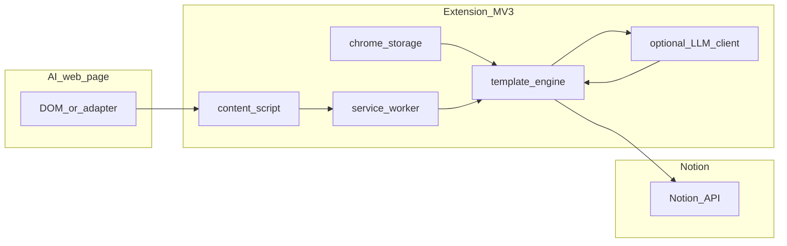

# MV3 说明与可定制内容结构方案

## 1. MV3 是什么

**MV3 = Manifest V3**，是 Chrome 扩展当前推荐的清单版本（取代 MV2）。

| 点 | 说明 |
|----|------|
| **清单文件** | [`manifest.json`](https://developer.chrome.com/docs/extensions/mv3/intro/) 中 `"manifest_version": 3`。 |
| **后台** | 使用 **Service Worker** 代替长期常驻的 background page；事件驱动、可被系统挂起，需避免依赖「长期内存状态」。 |
| **网络** | 扩展内请求仍可用 `fetch()`；需声明 `host_permissions` 或 `optional_host_permissions`（例如 Notion API、可选的 LLM API 域名）。 |
| **Content scripts** | 仍用于注入 AI 网页解析 DOM；与 background 通过 `chrome.runtime.sendMessage` / `chrome.tabs.sendMessage` 通信。 |

对你规划的产品：**MV3 是上架与长期维护的默认基线**；架构上要把「同步队列、令牌、用户模板」持久化到 `chrome.storage`，而不是依赖 service worker 里常驻变量。

---

## 2. 功能目标（你已确认：混合方案）

- **默认路径（无第三方 LLM）**：用户自定义 **标题格式**、**描述（subtitle/summary 或 Notion 属性）**、**正文结构**，全部用 **占位符 + 轻量规则** 在本地渲染。
- **高级路径**：用户可选开启 **「用 LLM 按提示词重组」**，把**已抽取的对话文本**（或摘要）发到用户自填的 **OpenAI 兼容端点**（base URL + API key 仅存本地并建议加密存储），再得到结构化 Markdown/块，最后写入 Notion。

这样兼顾：**开箱即用**、**可预测**、**高级用户可完全控制版式**，且 **LLM 为可选**，不把对话默认发到第三方。

---

## 3. 数据流（概念）



- **抽取**：content script 产出规范化 `Conversation`（消息列表、元数据：站点、模型名若可得、时间戳等）。
- **渲染**：
  - **模式 A（默认）**：`title = format(userTitleTemplate, ctx)`，`description = format(userDescTemplate, ctx)`，`body = format(userBodyTemplate, ctx)`；`ctx` 含占位符替换与简单循环（如「每条消息一节」）。
  - **模式 B（高级）**：将 `rawTextForLLM`（或结构化 JSON 字符串）+ **用户「重组提示词」** 发给 LLM；返回的 Markdown/JSON 再映射为 Notion blocks（或先 Markdown 再拆块）。
- **写出**：service worker 调 Notion API 创建/更新页面或数据库项。

---

## 4. 可定制项设计（建议）

### 4.1 占位符（默认模式）

统一文档化一组占位符，避免「魔法字符串」：

- 元数据：`{{date}}`、`{{time}}`、`{{site}}`、`{{model}}`、`{{conversation_id}}`（若可解析）
- 内容：`{{title_from_first_user_message}}`（截断长度可配置）、`{{message_count}}`
- 块级：在正文模板里支持 **重复段**，例如：

```text
{{#each messages}}
## {{role}}
{{content}}
{{/each}}
```

实现上可用 **Mustache/Handlebars 子集** 或自研极小模板（降低依赖与体积）。若只做「固定几段 + 列表」，可先 **Mustache 风格** 三五个指令，不必上完整 Handlebars。

### 4.2 标题 / 描述 / 内容职责划分

| 字段 | 映射建议 |
|------|----------|
| **Title** | Notion 页面 `title` 或数据库 `Name` 列 |
| **Description** | 数据库某 rich_text 列、或页面首段摘要属性；若只是单页，可写入 callout 或首段 paragraph |
| **Body** | 页面子块：按模板生成 `paragraph` / `heading` / `bulleted_list_item` 等 |

用户在 Options 里分别编辑三个模板；提供 **预设库**（Minimal、Thread、Q&A）一键应用。

### 4.3 高级：LLM 重组（混合）

- **开关**：`useLlmReformat: boolean`；关闭时绝不调用外部 API。
- **输入**：抽取后的对话 + 用户「重组提示词」（例如：「输出 Markdown，一级标题为摘要，下面按轮次编号」）。
- **输出约定**：优先 **Markdown**（易调试），再在扩展内 **Markdown → Notion blocks**（可用成熟库或简化版只支持标题/列表/段落）。
- **密钥与端点**：仅存 `chrome.storage.local`；使用 `optional_host_permissions` 对 LLM base URL 按需申请；失败时回退到模板模式并提示。

---

## 5. 风险与约束（简短）

- **DOM 变化**：站点适配器与模板解耦；解析失败时仍允许用户复制原文或导出 Markdown。
- **MV3 service worker**：长同步任务拆成可恢复步骤（队列 + 重试），避免一次消息过大导致 worker 被杀。
- **隐私**：LLM 开启时明确告知「将按你的设置把内容发往 xxx」；默认关闭。

---

## 6. 建议实现顺序（与仓库无关的通用里程碑）

1. **MVP**：单站点抽取 + 三模板字段 + Mustache 子集 + Notion 创建页。
2. **预设与校验**：标题/正文模板实时预览、占位符自动补全列表。
3. **LLM 可选路径**：OpenAI 兼容 `chat/completions`、超时/回退、密钥掩码 UI。
4. **增量**：多站点 adapter、数据库行模式、后台自动同步。

**本仓库落地**：代码在仓库根目录（Vite + TypeScript + MV3），模块对应 `src/lib/`（模板与存储）、`src/notion/`、`src/llm/`、`src/options/`、`src/content/`、`src/background/`。详见根目录 `README.md`。
